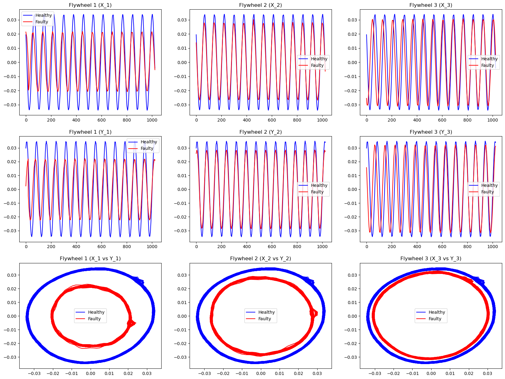
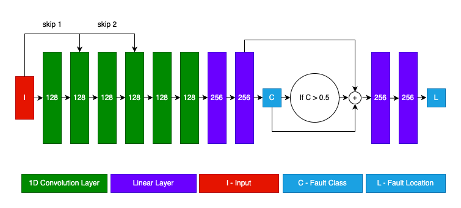
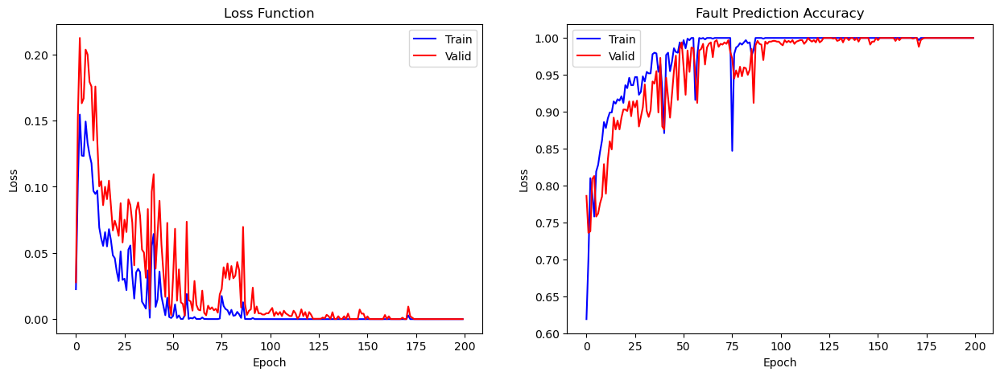
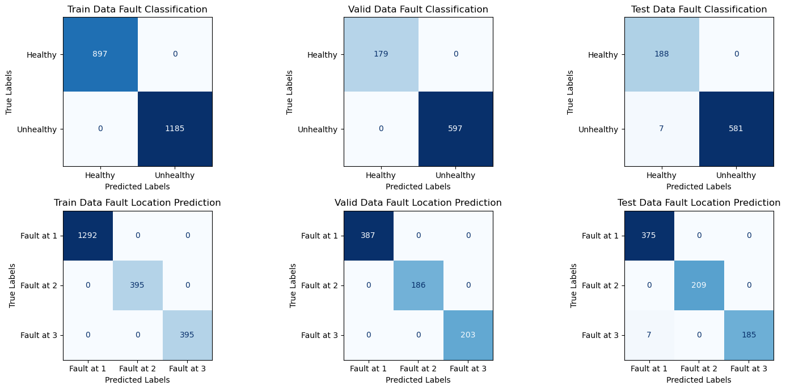

# **Data-Driven Fault Prediction Modeling of a Rotating Machine**
## **1. Preface**

This document encapsulates my final project undertaken for the course "TMR14 - Digital Twin Based Health Monitoring System" course during the second year of my masters program at [**NTNU, Trondheim**](https://ntnu.no/). I carried out this project in collaboration with my colleague, [Md Raqibur Rahman](https://github.com/AyonRRahman/).

## **2. Project Overview**
### **2.1. System Overview**

The project focused on a rotating machine comprising a shaft with three masses suspended at equal distances and two bearings at each end of the shaft. Rotary sensors on both x- and y-axes of each mass measure their rotational distances of each mass. Also, the fixed masses could be adjusted using weighted screws to introduce system imbalance. Hence, our aim was to develop a data-driven model using the distance data to diagnose and predict faults or imbalance in the machine.

### **2.2. Project Objectives**
The specific project objectives were to:
 1. Detect faults in the system using the 6 distance signals ​(i.e., identifying imbalance in any of the masses) 
 2. Pinpoint where the fault is (i.e., which of the masses has the imbalance)​
 3. Detect faults and faults location at different frequencies

## **3. Data Collection**
To achieve the specified objectives, we did the following during data collection
 1. Collected faulty and non-faulty signal data for frequencies 12.5 Hz,
    16 Hz, 20Hz, 25Hz, and 30 Hz​
 2. Collected 2 sets of 3 minutes long signal were collected for each category (faulty/non-faulty) and frequency​
 3. One set for each class and frequency was used as the training data while the other set was further divided into the validation and test data​

Moreover, Figure 3.1 below shows the signal for both healthy and unhealthy system state.

 
Figure 3.1: Signal Overview at 25Hz

## **4. Method and Model Architecture**
Our approach was entirely data-driven, employing a neural network to achieve the desired objectives. We also framed the problem as a multi-label classification task. 
Additionally, we purposefully structured our model to predict fault locations only when an unhealthy or faulty system state was predicted. 
​Hence the model has 2 prediction stages, namely:​    
-   Fault prediction (i.e., system is healthy or unhealthy​)
-   Fault location if system signal unhealthy​

The model architecture is therefore depicted in Figure 4.1 below 
  

  
Figure 4.1: Model Architecture

## **5. Training Configurations**
We used the following configurations to train our model
-   Loss Function: Binary Cross-entropy​    
-   Optimizer: Adam(learning rate:1e-3) with learning rate scheduler​
-   Data length: 512 ​
-   Batch size: 32
-   Epochs: 200 

## **6. Results**
### **6.1. Training and Validation Losses and Accuracies**

Figure 6.1: Final Training and Validation Losses and Accuracies

| Dataset | Accuracy (%) |
|--|--|
| Train | 100 |
| Validation | 100 |
| Test | 99 |
Table 6.1: Final Fault Prediction Accuracy

 

| Dataset | Fault @ mass 1 accuracy (%) | Fault @ mass 2 accuracy (%) | Fault @ mass 3 accuracy (%) |
|--|--|--|--|
| Train | 100 | 100 | 100 |
| Validation | 100 | 100 | 100 |
| Test | 100 | 100 | 99 |
Table 6.2: Final Fault Location Prediction Accuracy

### **6.2. Confusion Matrix**
## **Qualitative Results**

 
Figure 6.2: Confusion Matrices

## **7. Discussions**
By considering the problem as a multi-label classification problem and using a NN model that combines both convolution and linear layers, we were able to achieve high accuracy on both the fault prediction and fault location prediction problems.​ However, as part of the model verification and reliability testing, we could not implement the following evaluations​ because of the time available

- Test the model on different frequencies data we did not use for training​

- Test whether it can detect fault at multiple location​

- Test the model performance near the resonant frequency​

Therefore we cannot affirm if the model is robust enough for long-term use​.

​
## **8. Project Re-implementation**
To re-implement the experiment, kindly follow the steps below
- Run `conda create --name faultprediction && conda activate faultprediction && conda install --name faultprediction --file requirements.txt` to install required packages
- Run `python datasetup.py` do download and extract dataset from the 
- Edit training configuration parameters in `python train.py`
- Run `python train.py` to train the model

The optimized model weights and results can be found in the `checkpoints` directory.